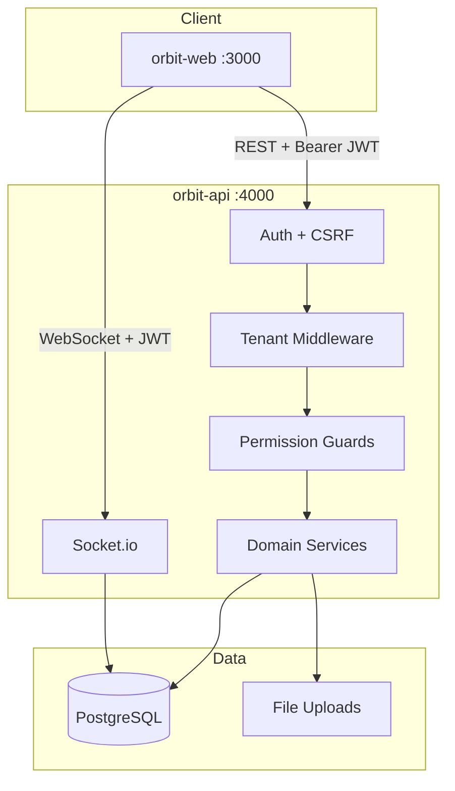

# Orbit

**Orbit** is a multi-tenant SaaS platform for team project management. Each organization gets an isolated workspace with projects, kanban tasks, team collaboration, real-time updates, analytics, and role-based access control.

This repository contains **two standalone applications** that work together:

| Project | Stack | Default URL |
|---------|-------|-------------|
| [**orbit-api/**](orbit-api/) | Express 4, TypeScript, Prisma 6, PostgreSQL, Socket.io | http://localhost:4000 |
| [**orbit-web/**](orbit-web/) | Next.js 16, React 19 | http://localhost:3000 |

Each folder is fully self-contained with its own `package.json`, dependencies, and environment configuration — no monorepo or shared root install required.

---

## Table of Contents

- [Features](#features)
- [Tech Stack](#tech-stack)
- [Architecture](#architecture)
- [Repository Structure](#repository-structure)
- [Prerequisites](#prerequisites)
- [Getting Started](#getting-started)
- [Environment Configuration](#environment-configuration)
- [Roles & Permissions](#roles--permissions)
- [Real-Time Updates](#real-time-updates)
- [Platform Admin](#platform-admin)
- [Security](#security)
- [Testing](#testing)
- [Production Deployment](#production-deployment)
- [Documentation](#documentation)
- [Troubleshooting](#troubleshooting)

---

## Features

### Authentication & Tenancy
- Organization registration with unique slug
- JWT access tokens + httpOnly refresh cookie rotation
- Email verification, forgot/reset password
- Strict tenant isolation on every database query
- Organization suspend/unsuspend (platform admin)

### Organization & Team
- Organization settings (name, logo, timezone, currency, theme)
- Team invitations with role assignment
- User profiles (avatar, bio, password change)
- Five RBAC roles with granular server-side permissions

### Projects & Tasks
- Full project CRUD with member management
- Project statuses: Planning, Active, On Hold, Completed, Archived
- Kanban board with drag-and-drop
- Tasks with assignee, due date, priority, and column position
- Task statuses: To Do, In Progress, Review, Done

### Collaboration
- Threaded task comments with @mentions and file attachments
- Activity logs with org- and project-level timelines
- In-app notifications (assignments, completions, invites) with bell icon

### Analytics & Calendar
- Dashboard charts: project health, task breakdown, team completion rate
- Calendar view for project deadlines and task due dates

### Real-Time
- Live task updates and notifications via Socket.io
- Rooms scoped by organization, project, and user

---

## Tech Stack

| Layer | Technologies |
|-------|--------------|
| **Frontend** | Next.js 16, React 19, CSS Modules, Recharts, react-big-calendar, @dnd-kit |
| **Backend** | Express 4, TypeScript, Zod validation |
| **Database** | PostgreSQL, Prisma 6 |
| **Auth** | JWT, bcrypt, refresh token rotation |
| **Real-time** | Socket.io |
| **Testing** | Vitest, Supertest (API) |

---

## Architecture



### Tenant isolation

1. **JWT** — access token embeds `organizationId` and `userId`
2. **AsyncLocalStorage** — tenant context bound per request
3. **Prisma extension** — automatically injects `organizationId` on all tenant-scoped models

Cross-tenant data access is prevented at every layer. Platform admin routes use raw Prisma with explicit checks.

---

## Repository Structure

```
.
├── orbit-api/              # Backend (standalone Node project)
│   ├── prisma/             # Schema + migration history
│   ├── src/                # Express routes, services, middleware
│   ├── docs/API.md         # REST + WebSocket reference
│   ├── .env.example
│   └── README.md
├── orbit-web/              # Frontend (standalone Next.js project)
│   ├── src/                # App Router pages and components
│   ├── .env.example
│   └── README.md
└── README.md               # This file
```

---

## Prerequisites

- **Node.js** 20+ (22 recommended)
- **PostgreSQL** 14+
- **npm** 9+

---

## Getting Started

### 1. Clone the repository

```bash
git clone https://github.com/faruqer/Team-Project-Management.git
cd Team-Project-Management-Multi-Tenant-SaaS
```

### 2. Set up the API

```bash
cd orbit-api
npm install
cp .env.example .env
```

Edit `orbit-api/.env` — at minimum set `DATABASE_URL`, `JWT_ACCESS_SECRET`, and `JWT_REFRESH_SECRET` (each min 32 characters).

Create the PostgreSQL database if it does not exist:

```bash
createdb orbit
```

Run migrations and start the API:

```bash
npm run db:generate
npm run db:migrate
npm run dev
```

The API listens on **http://localhost:4000**. Verify with `GET /health`.

### 3. Set up the web app

Open a second terminal:

```bash
cd orbit-web
npm install
cp .env.example .env
npm run dev
```

Open **http://localhost:3000** and register your organization.

### 4. Connect the two apps

Ensure these values match:

| orbit-api `.env` | orbit-web `.env` |
|------------------|------------------|
| `FRONTEND_URL=http://localhost:3000` | — |
| — | `NEXT_PUBLIC_API_URL=http://localhost:4000` |

`FRONTEND_URL` controls CORS and Socket.io allowed origins on the API. `NEXT_PUBLIC_API_URL` is used for all REST and WebSocket calls from the web app.

---

## Environment Configuration

### orbit-api

| Variable | Required | Description |
|----------|----------|-------------|
| `DATABASE_URL` | Yes | PostgreSQL connection string |
| `JWT_ACCESS_SECRET` | Yes | Min 32 characters |
| `JWT_REFRESH_SECRET` | Yes | Min 32 characters |
| `FRONTEND_URL` | Yes | Web app origin (CORS + Socket.io) |
| `API_PORT` | No | Default `4000` |
| `API_URL` | No | Public API URL for upload links |
| `SMTP_*` | No | Email delivery (optional in dev) |
| `PLATFORM_ADMIN_EMAILS` | No | Comma-separated emails for platform admin |

Full details: [orbit-api/README.md](orbit-api/README.md)

### orbit-web

| Variable | Required | Description |
|----------|----------|-------------|
| `NEXT_PUBLIC_API_URL` | Yes | API base URL (REST + Socket.io) |

Set before `npm run build` — Next.js embeds `NEXT_PUBLIC_*` at build time.

Full details: [orbit-web/README.md](orbit-web/README.md)

---

## Roles & Permissions

| Role | Description |
|------|-------------|
| **Super Admin** | Full access within the organization |
| **Organization Admin** | Manage org, team, projects, and tasks |
| **Project Manager** | Manage projects and tasks, invite team |
| **Team Member** | Work on assigned projects and tasks |
| **Client** | Read-only project/task access, can comment |

Permissions are enforced server-side via middleware. The web app mirrors a subset for UI gating — the API is always authoritative.

---

## Real-Time Updates

The web app connects to the API via Socket.io using the JWT access token:

```typescript
import { io } from 'socket.io-client';

const socket = io(process.env.NEXT_PUBLIC_API_URL, {
  auth: { token: accessToken },
});
```

| Event | Scope | Description |
|-------|-------|-------------|
| `task:created` | project | New task on kanban |
| `task:updated` | project | Task moved or edited |
| `task:deleted` | project | Task removed |
| `notification:new` | user | New in-app notification |
| `activity:new` | org / project | Activity log entry |

---

## Platform Admin

Cross-tenant administration requires:

1. `SUPER_ADMIN` role in an organization
2. Email listed in `PLATFORM_ADMIN_EMAILS` (API `.env`)

Capabilities: list all organizations, suspend/unsuspend tenants.

UI: `/admin` (sidebar link appears for platform admins only)

---

## Security

| Measure | Implementation |
|---------|----------------|
| Rate limiting | 300 req/15 min general; 30 req/15 min on auth |
| CSRF | Double-submit cookie on login, register, refresh, logout |
| XSS | Comment bodies sanitized server-side |
| Headers | Helmet security headers |
| Validation | Zod on all request bodies and route params |
| Tenant isolation | JWT + Prisma extension on every scoped query |
| Passwords | bcrypt (12 rounds) |
| Tokens | Short-lived access JWT; refresh rotation with family revocation |

---

## Testing

API tests (run from `orbit-api/`):

```bash
cd orbit-api
npm test
```

Covers role permissions, tenant isolation guards, XSS sanitization, Zod schemas, and HTTP integration tests.

---

## Production Deployment

Deploy **orbit-api** and **orbit-web** independently (different hosts, Docker containers, or PaaS services).

**API**

```bash
cd orbit-api
npm install
cp .env.example .env
# Set production DATABASE_URL, secrets, FRONTEND_URL, API_URL

npm run db:generate
npm run db:migrate:deploy
npm run build
npm start
```

**Web**

```bash
cd orbit-web
npm install
cp .env.example .env
# Set NEXT_PUBLIC_API_URL to your production API URL

npm run build
npm start
```

Run the API behind HTTPS. Set `NODE_ENV=production` on the API. Ensure `FRONTEND_URL` matches your deployed web origin exactly.

---

## Documentation

| Document | Description |
|----------|-------------|
| [orbit-api/README.md](orbit-api/README.md) | API setup, scripts, production |
| [orbit-web/README.md](orbit-web/README.md) | Web setup, scripts, production |
| [orbit-api/docs/API.md](orbit-api/docs/API.md) | Full REST + WebSocket API reference |

---

## Troubleshooting

### API won't start — invalid environment

Check that `DATABASE_URL`, `JWT_ACCESS_SECRET`, and `JWT_REFRESH_SECRET` are set in `orbit-api/.env`. Secrets must be at least 32 characters.

### Login fails / CSRF errors

Start the API before the web app. The web client fetches a CSRF token before auth requests. Ensure cookies are enabled and `FRONTEND_URL` matches the web origin.

### WebSocket not connecting

Verify `NEXT_PUBLIC_API_URL` in `orbit-web/.env` and `FRONTEND_URL` in `orbit-api/.env`. Both must point to the correct hosts and use matching schemes (`http` vs `https`).

### Migration errors

```bash
cd orbit-api
npx prisma migrate status
npx prisma migrate deploy
```

For a clean dev database (destroys data):

```bash
npx prisma migrate reset
```

### `NEXT_PUBLIC_API_URL is not defined`

Copy `orbit-web/.env.example` to `orbit-web/.env` before running dev or build.

### Suspended organization

Users see *"Organization has been suspended"* at login. Platform admins can unsuspend via `/admin`.

---

## License

Private — all rights reserved unless otherwise specified.
